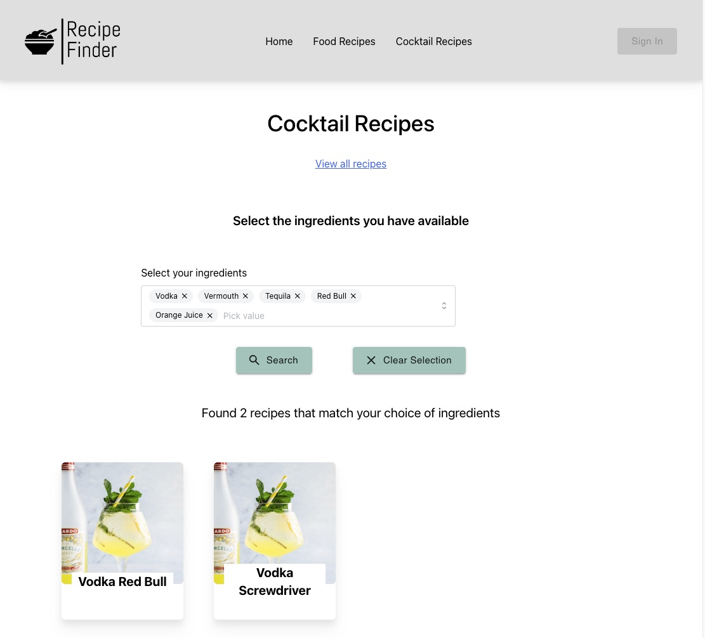

# Recipe Finder - Find your next recipe based on the ingredients you have available!


Application for finding recipes, based on your selection of ingredients.



The application is deployed using Vercel.

-   Backend project: https://vercel.com/kristiankjerstad/recipe-app-backend
-   Frontend project: https://vercel.com/kristiankjerstad/recipe-app-frontend

Urls to application

-   Backend: https://recipe-app-backend-tan.vercel.app/
-   Frontend: https://recipe-app-frontend-ochre.vercel.app/

# Running the app

Requirements

-   Docker and Docker compose
-   Python 3.11
-   Node

First, you must create 3 environment variable files inside the `backend` folder:

-   .env
-   local.env
-   local.docker.env

use the .env.template file as a template.

To start the backend and frontend, run the command

```bash
docker-compose up --build
```

Now, the frontend application is available at http://localhost:5173/ and the backend application is available at http://localhost:5000

## Running debugging and tests for the API

For this to work, you first need to create a new Python virtual environment with the name `.venv` inside the `backend` folder:

```bash
cd backend
python -m venv .venv
source .venv/bin/activate
```

To run the API debugger, you have to

1. Stop the docker-compose service (docker-compose down).
2. Open the docker-compose.yaml file and comment out the `backend` service.
3. Start docker compose again to start the database.
4. Open up VS code, and open the "Run and debug" window.
5. In drop down menu, select "Python: FastAPI"

Now, you can set break points anywhere in the python code.

## Running frontend unit tests

From the terminal, navigate to the frontend folder and run

```bash
npm run test
```

## Running frontend end to end tests

From the terminal, navigate to the frontend folder and run

```bash
npx playwright test
```

To do an interactive test, use the extra argument `-ui`

To create new end to end tests automatically, use the command

```bash
 npx playwright codegen
```

## Checking code coverage

Vitest has coverage enabled in the settings. When running `npm run dev`, the vitest UI will open in http://localhost:51204/**vitest**/#/?file=

TODO its not working at the moment...

## Connecting to the local database

To connect to the local database, started using docker-compose, you can for example use a tool like Azure data studio.

Connection info:

-   server name: localhost
-   password: development
-   user name: postgres
-   database name: dev_db

# API documentation

API documentation is automatically created and available at http://localhost:5173/docs

# Authentication with the API

Authentication is enabled with JWT. To create a new jwt token, use http://jwtbuilder.jamiekurtz.com/
with this info:

-   Issuer = "Online JWT Builder"
-   Audience = "recipe-app"
-   subject = "general-user"

-   Role = "user"

-   Key = secret key, ask admin for this
